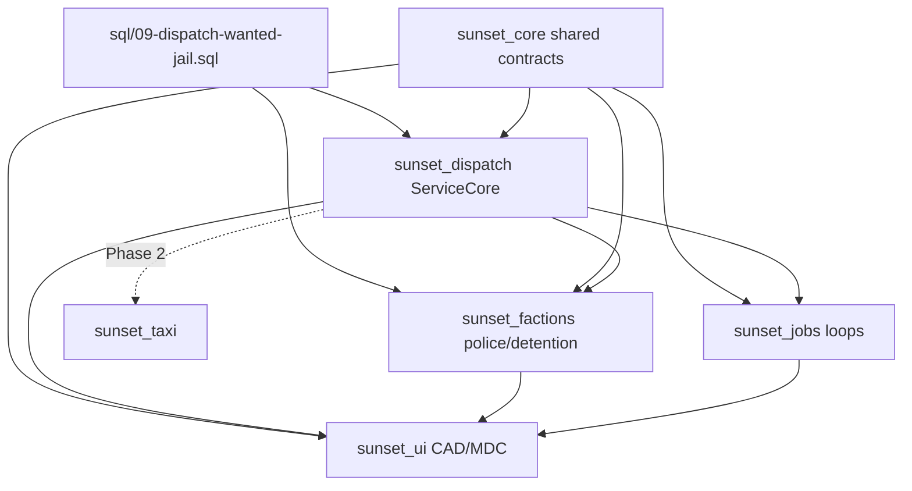

# SunsetMP RPG Implementation Plan

**Owner:** Integration Agent  
**Baseline:** `76deaa4` (faction core, detention, police partial, taxi, jobs stubs)  
**Date:** 2026-09-03

---

## 1. Architecture Overview

SunsetMP is a custom FiveM RPG built on modular `sunset_*` resources. This overhaul adds **persistent law-enforcement data**, a **unified dispatch layer**, and **civilian job session loops** without breaking existing faction/taxi flows.

```
┌─────────────────────────────────────────────────────────────────┐
│                        sunset_ui (Agent UI)                      │
│   MDC, ticket panel, dispatch CAD, job HUD, phone apps           │
└───────────────┬───────────────────────────────┬─────────────────┘
                │ NUI / exports                  │
┌───────────────▼───────────────┐   ┌───────────▼─────────────────┐
│     sunset_factions           │   │      sunset_jobs (Agent Jobs)│
│  police, detention, EMS stub  │   │  trucker, fisherman loops    │
└───────────────┬───────────────┘   └───────────┬─────────────────┘
                │                                │
┌───────────────▼───────────────────────────────▼─────────────────┐
│                    sunset_dispatch (Integration)                   │
│  ServiceCore: createCall / acceptCall / cancelCall / completeCall │
│  Channels: law_enforcement, ems, fire_rescue, transport, mechanic │
└───────────────┬───────────────────────────────────────────────────┘
                │
┌───────────────▼───────────────────────────────────────────────────┐
│                         sunset_core                                │
│  shared/dispatch.lua · shared/job_session.lua · shared/faction_core│
│  player, money, callbacks, profile (job vs faction)                │
└───────────────┬───────────────────────────────────────────────────┘
                │
┌───────────────▼───────────────────────────────────────────────────┐
│  MariaDB: service_calls, wanted_records, jail_sentences, tickets   │
└────────────────────────────────────────────────────────────────────┘
```

### Design principles

1. **Server authority** — money, wanted, jail, dispatch assignment, job payouts.
2. **Capability model** — use `Sunset.HasFactionCapability()` not `factionId == 'police'`.
3. **Callbacks over NetEvents** — gameplay actions via `sunset_core:RegisterCallback`.
4. **Shared contracts first** — agents implement against `dispatch.lua` / `job_session.lua` types.
5. **Atomic dispatch** — one responder per call; DB row lock on accept.

### Existing systems (do not rewrite)

| System | Resource | Status |
|--------|----------|--------|
| Faction duty/HQ | `sunset_factions` | Working |
| Detention FSM | `sunset_factions/detention.lua` | Working (memory) |
| Wanted/arrest | `sunset_factions/police.lua` | Memory-only |
| Taxi rides | `sunset_taxi` | Full loop + `taxi_rides` table |
| Civilian hire | `sunset_jobs` | Stub only |
| Faction leaders | `sql/08-faction-core.sql` | Deployed |

---

## 2. Agent Assignments

| Agent | Scope | Owns |
|-------|-------|------|
| **Integration** (this doc) | Contracts, dispatch scaffold, SQL 09, deploy, manifests | `sunset_dispatch/`, `sunset_core/shared/dispatch.lua`, `job_session.lua`, `sql/09-*`, `deploy.sh`, `server.cfg.template`, this plan |
| **Agent Factions** | Police persistence, detention state bags, EMS/fire stubs | `sunset_factions/server/police.lua`, `detention.lua`, new `ems.lua`/`fire.lua` |
| **Agent Jobs** | Civilian job loops | `sunset_jobs/server/trucker.lua`, `fisherman.lua`, client routes |
| **Agent UI** | MDC, dispatch CAD, ticket UI, job HUD | `sunset_ui/web/*`, `nui_bridge.lua`, `panels.js` |
| **Agent Taxi** | Optional: migrate rides to `service_calls` | `sunset_taxi/server/main.lua` (Phase 2) |

### Integration agent responsibilities

- Define and freeze shared interfaces before feature work.
- Scaffold `sunset_dispatch` with atomic ServiceCore API.
- Run SQL migration 09 on deploy.
- Merge parallel agent PRs; resolve manifest / `server.cfg` conflicts.
- Final deploy verification.

---

## 3. Dependency Graph



**Build order**

1. Integration: contracts + SQL 09 + `sunset_dispatch` scaffold *(this session)*
2. Factions: wire wanted/jail to `wanted_records` / `jail_sentences`
3. UI: dispatch list + MDC history panels (read ServiceCore exports)
4. Jobs: sessions via `job_session.lua` types
5. Taxi: optional `service_calls` bridge (low priority)

---

## 4. Shared Interfaces

### 4.1 Dispatch (`sunset_core/shared/dispatch.lua`)

| Symbol | Purpose |
|--------|---------|
| `Sunset.Dispatch.CallStatus` | `pending`, `accepted`, `en_route`, `on_scene`, `completed`, `cancelled` |
| `Sunset.Dispatch.CallType` | `ems_medical`, `fire`, `police_backup`, `mechanic_roadside`, `civilian_distress`, `taxi_ride` |
| `Sunset.Dispatch.Channel` | Maps to `Sunset.FactionTypes` archetypes |
| `Sunset.Dispatch.IsTerminalStatus(s)` | Whether call is closed |
| `Sunset.Dispatch.CanTransition(from, to)` | State machine guard |
| `Sunset.Dispatch.EncodeCoords(v)` | JSON-safe coords |

### 4.2 Job sessions (`sunset_core/shared/job_session.lua`)

| Symbol | Purpose |
|--------|---------|
| `Sunset.JobSession.Status` | `idle`, `briefing`, `active`, `completing`, `completed`, `failed`, `abandoned` |
| `Sunset.JobSession.Kind` | `trucker`, `fisherman`, `garbage`, `courier` |
| `Sunset.JobSession.CanTransition(from, to)` | State machine guard |
| `Sunset.JobSession.IsActive(status)` | Whether player is in a job loop |

### 4.3 ServiceCore exports (`sunset_dispatch`)

```lua
exports.sunset_dispatch:CreateCall(opts)      -- opts: type, channel, location, description, callerCharId, priority, metadata
exports.sunset_dispatch:AcceptCall(callId, responderSource)
exports.sunset_dispatch:CancelCall(callId, source, reason)
exports.sunset_dispatch:CompleteCall(callId, source, metadata)
exports.sunset_dispatch:GetCall(callId)
exports.sunset_dispatch:GetActiveCalls(channel)
exports.sunset_dispatch:GetCallForResponder(characterId)
```

**Callbacks (for UI)**

- `sunset:dispatchList` — list pending/accepted for channel
- `sunset:dispatchGet` — single call detail

### 4.4 Events (broadcast)

| Event | Direction | Payload |
|-------|-----------|---------|
| `sunset:client:dispatchCallCreated` | server → clients on channel | serialized call |
| `sunset:client:dispatchCallUpdated` | server → clients on channel | serialized call |
| `sunset:client:jobSessionUpdate` | server → owner | session snapshot |

---

## 5. Migration Strategy

### Phase A — Contracts (this commit)

- Add `dispatch.lua`, `job_session.lua`, SQL 09, `sunset_dispatch` scaffold.
- No behavior change to existing wanted/jail (still memory).
- Deploy runs `09-dispatch-wanted-jail.sql` idempotently.

### Phase B — Police persistence (Agent Factions)

- On `/su`: insert `wanted_records`; load active on character spawn.
- On `/arrest`: insert `jail_sentences`; restore sentence on reconnect.
- On `/ticket` / `/fine`: insert `tickets` (UI uses `tickets` table).
- Deprecate in-memory `Wanted` table gradually; keep export compat.

### Phase C — Dispatch consumers ✅

- `/backup` → `CreateServiceCall(police_backup)` — notifies LEO/EMS/LSFD + temp blips; `/cbackup` cancels.
- `/service medic|fire|mechanic|taxi` → unified dispatch queue.
- Civilian mechanic `/work` shift wired to AcceptCall/CompleteCall.

### Phase D — Job loops (Agent Jobs)

- `sunset_jobs` creates no dispatch calls initially; uses `JobSession` locally.
- Future: courier distress → `civilian_distress` call type.

### Phase E — Taxi bridge (optional)

- Mirror `taxi_rides` status changes into `service_calls` for unified CAD.

### Rollback

- SQL 09 tables are additive; safe to leave empty.
- Remove `ensure sunset_dispatch` from `server.cfg` if rollback needed.

---

## 6. Conflict-Risk Files

| File | Risk | Mitigation |
|------|------|------------|
| `sunset_core/fxmanifest.lua` | Multiple agents add shared scripts | Integration owns ordering; append only |
| `config/server.cfg.template` | Duplicate `ensure` lines | Integration merges; one block |
| `deploy.sh` | SQL migration order | Integration appends `09` only |
| `sunset_factions/server/police.lua` | Wanted persistence overlap | Factions agent uses SQL 09 schema |
| `sunset_factions/server/main.lua` | Fine/ticket insert | Factions writes to `tickets` table |
| `sunset_ui/web/js/panels.js` | UI agent primary owner | Integration does not edit |
| `sunset_ui/client/nui_bridge.lua` | NUI callback wiring | UI agent adds dispatch callbacks |
| `sunset_jobs/server/main.lua` | Job hire vs session | Jobs agent adds new files, not hire logic |
| `sunset_taxi/server/main.lua` | Ride vs service_call | Phase E only |

---

## 7. Acceptance Criteria

### Integration (Phase A)

- [ ] `docs/RPG_IMPLEMENTATION_PLAN.md` committed
- [ ] `sunset_core/shared/dispatch.lua` and `job_session.lua` loaded by `sunset_core`
- [ ] `sql/09-dispatch-wanted-jail.sql` creates 4 tables
- [ ] `deploy.sh` runs migration 09
- [ ] `sunset_dispatch` starts without errors; exports registered
- [ ] `server.cfg.template` includes `ensure sunset_dispatch`
- [ ] `CreateCall` → `AcceptCall` → `CompleteCall` works atomically (one accept wins)
- [ ] Double-accept returns error on second attempt

### Factions (Phase B)

- [ ] Wanted survives server restart for online/offline characters
- [ ] Jail sentence survives disconnect
- [ ] Tickets persisted with paid flag

### UI (Phase C)

- [ ] Dispatch panel shows pending calls for on-duty channel
- [ ] MDC shows wanted history from `wanted_records`

### Jobs (Phase D)

- [ ] Trucker: pickup → delivery → payout using `JobSession` states
- [ ] Abandon sets `abandoned` and clears session

### Deploy

- [ ] `main` pushed to origin
- [ ] VPS `./deploy.sh` completes; migration 09 applied
- [ ] FiveM console: no errors from `sunset_dispatch`

---

## 8. File Ownership Summary

**Integration agent (write access)**

```
docs/RPG_IMPLEMENTATION_PLAN.md
resources/[sunset]/sunset_core/shared/dispatch.lua
resources/[sunset]/sunset_core/shared/job_session.lua
resources/[sunset]/sunset_core/fxmanifest.lua
resources/[sunset]/sunset_dispatch/**
sql/09-dispatch-wanted-jail.sql
deploy.sh
config/server.cfg.template
```

**Read-only for integration**

```
resources/[sunset]/sunset_ui/**
resources/[sunset]/sunset_jobs/server/trucker.lua (Jobs agent)
resources/[sunset]/sunset_factions/server/police.lua (Factions agent)
```

---

## 9. References

- [RPG_FRAMEWORK_AUDIT.md](./RPG_FRAMEWORK_AUDIT.md)
- [POLICE.md](./POLICE.md)
- [JOBS.md](./JOBS.md)
- [RPG_TEST_PLAN.md](./RPG_TEST_PLAN.md)
